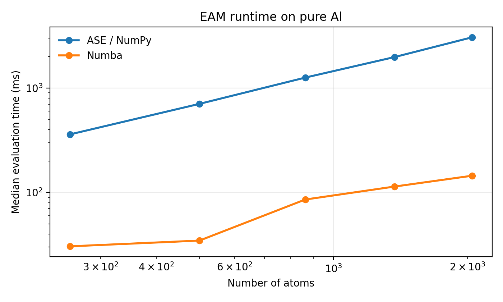

Performance
===========

ForgeFF includes two evaluation paths for tabulated semi-empirical models:

- the NumPy-backed ASE EAM path
- the Numba-accelerated EAM and ADP paths

This page shows how they behave as the system size grows for pure Al.
The benchmark uses the NIST reference files already shipped with the repo:

- :download:`Al99.eam.alloy <../tests/data_path/nist/Al99.eam.alloy>`
- :download:`AlCu.adp <../tests/data_path/nist/AlCu.adp>`

How the benchmark is measured
-----------------------------

The benchmark script builds fcc Al supercells with increasing size,
evaluates each calculator several times, and reports the median runtime
per configuration.

The script uses conventional cubic Al cells and starts from a moderately
large supercell so the plot reflects the calculator scaling instead of
small-cell neighbor-list binning artifacts.

The important point is not the exact millisecond count. The point is the
trend:

- small systems are often dominated by setup overhead
- larger systems show the scaling behavior more clearly
- Numba becomes more attractive when the atom count grows

One important caveat for the plotted data:

- the Numba path uses ASE's neighbor-list builder
- that builder partitions space into bins
- for this Al benchmark, the 5x5x5 supercell sits just below a binning
  threshold, so it looks unusually slow
- the 6x6x6 point drops back to the expected scaling regime

So the kink in the curve is not a Numba algorithm regression. It is a
neighbor-list binning threshold.

EAM scaling
-----------

   ASE vs Numba evaluation time for the NIST Al EAM potential.

For EAM, the ASE-backed NumPy path is a good reference, and the Numba path
reduces evaluation time as the system size grows. On very small cells, the
gap is small because overhead dominates. On larger Al supercells, the Numba
path pulls ahead more clearly.

ADP scaling
-----------

.. figure:: _static/performance/adp_runtime.png
   :align: center
   :alt: ADP runtime comparison on pure Al

   ASE vs Numba evaluation time for the NIST Al-Cu ADP potential evaluated on pure Al.

ADP has more angular work than EAM, so the Numba backend gains more from
avoiding Python-level overhead. That makes the speed gap more visible as the
number of atoms increases.

How to regenerate the plots
---------------------------

Run the benchmark script from the repo root:

.. code-block:: bash

   python benchmarks/speed_eam_adp.py

The script writes the plots and the raw timing data to
``docs/_static/performance/``.
