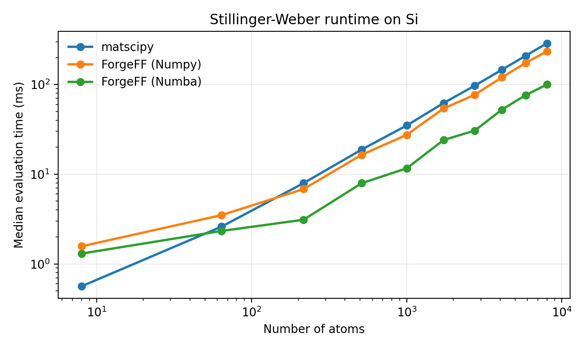
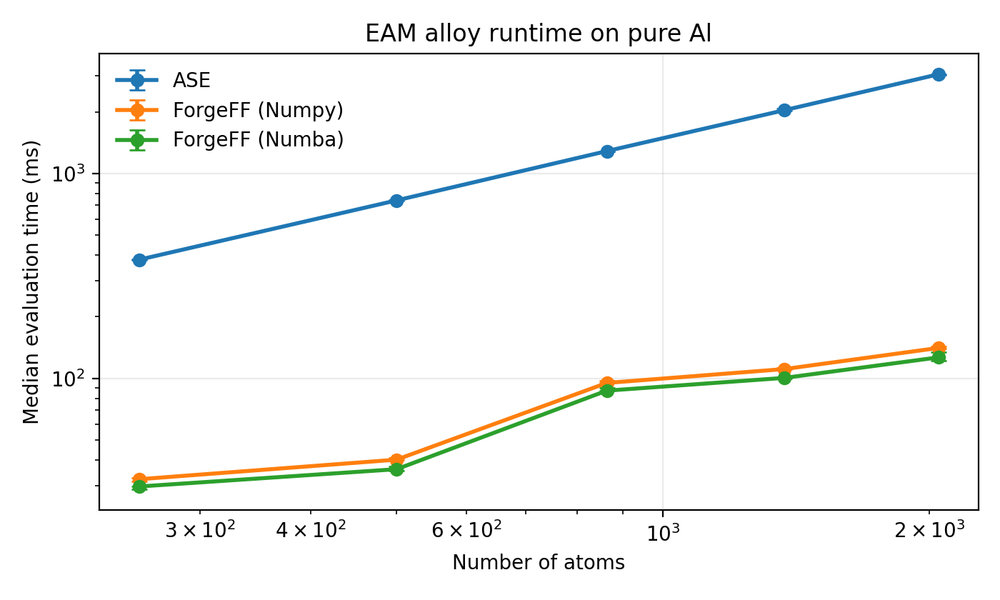
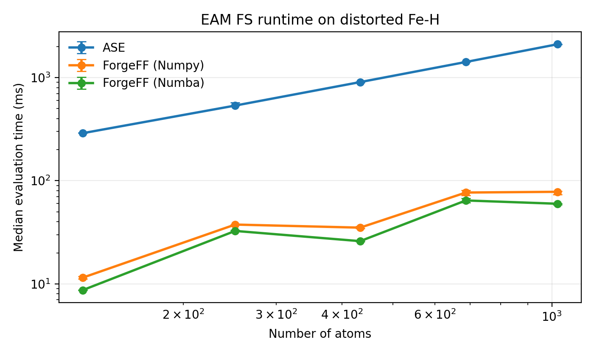
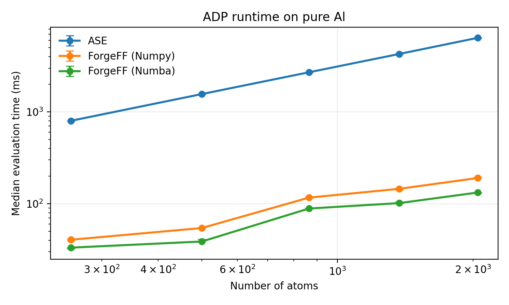
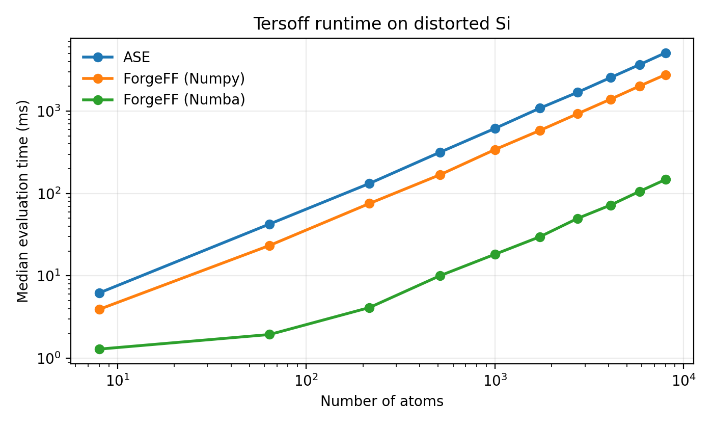

Performance
===========

ForgeFF includes evaluation paths for several semi-empirical models:

- the matscipy-reference Stillinger-Weber path
- the ASE reference path for EAM and ADP
- the ASE reference path for Tersoff
- the ForgeFF NumPy and ForgeFF Numba paths for SW, EAM, ADP, and Tersoff

This page shows how they behave as the system size grows for reference
benchmark systems. The benchmark uses the reference files already shipped with
the repo:

- :download:`Al99.eam.alloy <../tests/data_path/nist/Al99.eam.alloy>`
- :download:`Fe_H_Kumar2023.eam.fs <../tests/data_path/nist/Fe_H_Kumar2023.eam.fs>`
- :download:`AlCu.adp <../tests/data_path/nist/AlCu.adp>`
- matscipy Stillinger-Weber parameters are embedded directly in the benchmark
  script for a pure Si diamond test case
- the Tersoff benchmark uses a standard Si triplet parameter set embedded in
  the benchmark script

How the benchmark is measured
-----------------------------

The benchmark scripts build reference supercells with increasing size,
evaluate each calculator several times, and report the median runtime per
configuration.

The EAM alloy benchmark uses conventional cubic Al cells. The EAM FS benchmark
uses a distorted BCC Fe-H cell. The ADP benchmark uses conventional cubic Al
cells. The SW and Tersoff benchmarks use diamond Si supercells.

The important point is not the exact millisecond count. The point is the
trend:

- small systems are often dominated by setup overhead
- larger systems show the scaling behavior more clearly
- Numba becomes more attractive when the atom count grows

One important caveat for the plotted data:

- the Numba path uses ASE's neighbor-list builder
- that builder partitions space into bins
- for this Al benchmark, the 5x5x5 supercell sits just below a binning
  threshold, so it looks unusually slow
- the 6x6x6 point drops back to the expected scaling regime

So the kink in the curve is not a Numba algorithm regression. It is a
neighbor-list binning threshold.

Stillinger-Weber scaling
------------------------

   matscipy reference vs ForgeFF NumPy and ForgeFF Numba evaluation time for the Si SW potential.

This benchmark compares ForgeFF's NumPy and Numba Stillinger-Weber engines
against the matscipy many-body reference implementation on a diamond Si
supercell. The goal is to show that ForgeFF can match the reference physics
while moving the inner loops into compiled code.

EAM alloy scaling
------------------

   ASE vs ForgeFF NumPy and ForgeFF Numba evaluation time for the NIST Al EAM alloy
   potential.

For EAM alloy, the ASE path is the external reference, ForgeFF's NumPy path is
the native bridge, and the Numba path reduces evaluation time as the system
size grows. On very small cells, the gap is small because overhead dominates.
On larger Al supercells, the Numba path pulls ahead more clearly.

EAM FS scaling
--------------

   ASE vs ForgeFF NumPy and ForgeFF Numba evaluation time for the NIST Fe-H EAM FS
   potential.

The same three-way comparison is shown for the Finnis-Sinclair layout. The
benchmark uses a distorted BCC Fe-H cell so the runtime path exercises the FS
density tables.

ADP scaling
-----------

   ASE vs ForgeFF NumPy and ForgeFF Numba evaluation time for the NIST Al-Cu ADP potential evaluated on pure Al.

ADP has more angular work than EAM, so both the NumPy and Numba ForgeFF
engines gain more from avoiding Python-level overhead. That makes the speed
gap more visible as the number of atoms increases.

Tersoff scaling
---------------

   ASE vs ForgeFF NumPy and ForgeFF Numba evaluation time for a standard Si
   Tersoff parameter set.

The Tersoff benchmark uses distorted diamond Si supercells from ``1x1x1`` to
``10x10x10``. The ForgeFF NumPy backend is a direct reference implementation,
and the Numba backend uses the same neighbor layout with compiled inner loops.

How to regenerate the plots
---------------------------

Run the benchmark script from the repo root:

.. code-block:: bash

   python benchmarks/speed_sw.py
   python benchmarks/speed_eam_adp.py
   python benchmarks/speed_tersoff.py

The scripts write the plots and the raw timing data to
``docs/_static/performance/``.
